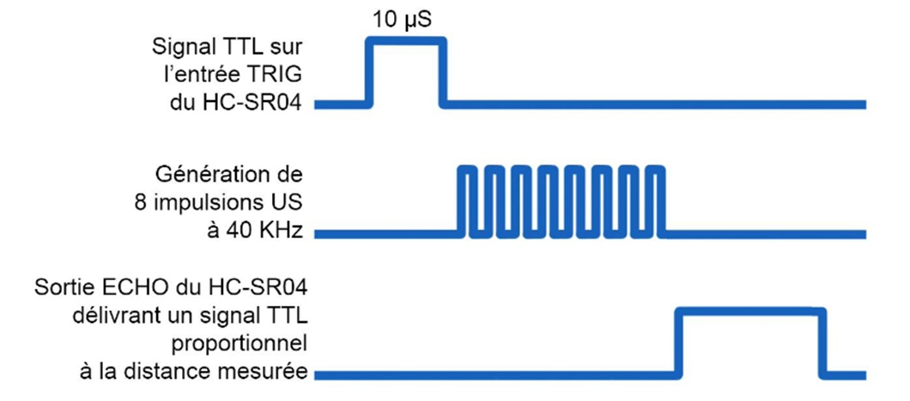

# Atelier avancé sur les cartes Arduino Uno / Nano

**Retrouver l'ensemble des informations développées lors de l'atelier sous forme de *carte mentale*:**  
http://www.xmind.net/m/R2VMrr

Fichier au format XMind dans le dossier [./datasheets](./datasheets)

Dans ce dossier, vous trouverez les schémas des cartes Arduino Uno et Nano ainsi que la documentation technique du µC ATMega 328.

Le document le plus important reste celui des **PINOUT** décrivant pour chaque broche le port et les différents signaux rattachés.

*Ce dépôt vient en support aux ateliers effectués par le Club Robotic974, il n'a pas vocation à être utiliser comme un cours tel quel.*

---

## Plan de de l'atelier

## Les Interruptions

---

### **Exercice 1:** Blink de la LED *onboard* par interruption externe **INTx**

**Objectif:** Faire allumer/éteindre la LED *onboard* rattachée à la broche 13 à la suite d'un changement d'état sur la broche 2 qui lèvera donc une interruption de type INT0_vect  

Se référer au dossier: [01_Blink13_interrupt_INT0_vect](./01_Blink13_interrupt_INT0_vect)

Le fichier *main.cpp* contient différentes routines d'interruption (v1, v2, v3) à rattacher en fonction de vos tests.

Tous les détails se trouvent en commentaire dans le code source.

---

### **Exercice 2:** Blink de la LED *onboard* par interruption externe **PCINTx**

**Objectif:** Idem exercice 1, mais avec un changement d'état sur la broche 8.
Cette broche est rattachée au vecteur d'interruption PCINT0_vect qui sera levée lors d'un changement d'état sur l'une des broches D8 à D13.
Il conviendra donc d'appliquer un masque afin de désactiver la levée d'interruption sur les autres broches du port B.

Se référer au dossier: [02_Blink13_interrupt_PCINT0_vect](./02_Blink13_interrupt_PCINT0_vect)

Tous les détails se trouvent en commentaire dans le code source.

---

### **Exercice 3:** Mesure de distance avec le Capteur **HC-SF04** par interruption

**Objectif:** Effectuer des mesures de distance par le capteur HC-SF04 en remplacent la fonction bloquante pulseIn() par une gestion par interruption de la broche ECHO.

Atelier précédent sur le capteur HC-SF04: https://github.com/ctw974/Ultrasonic-sensor

#### **Rappel du principe de fonctionnement du capteur HC-SF04:**

1. Pour lancer une nouvelle mesure, il convient de passer la broche TRIGGER à l'état **HAUT** pendant 10 µs

2. Le capteur va générer 8 trains d'ondes ultra-son à 40 Khz

3. Puis le capteur va passer la broche ECHO à l'état **HAUT** marquant ainsi le début de la mesure

4. A la réception du retour des *ultra-son*, le capteur va passer la broche ECHO à l'état **BAS**. Donc le temps entre le passage de l'état **HAUT** à l'état **BAS** correspondra à la distance mesurée.

**Aide N°1:** Le lancement d'une nouvelle mesure se fait dans la boucle principale (pour cet exercice) de la même manière que lors du précèdent atelier du capteur HC-SF04 (lien ci dessus)

**Aide N°2:** Avoir une variable afin de lancer une nouvelle mesure que si la precedente est terminée

**Aide N°3:** La routine d'interruption sera lancée à chaque changement de la broche ECHO. A vous de bien choisir la broche de la carte Arduino=> ATmega328.

---

## Lors du Prochain Atelier

- Correction de l'exercice 3
- Les Timers
  - Déclenchement cyclique par Timer de la mesure de distance
- Les modes *Sleep*
- ...
